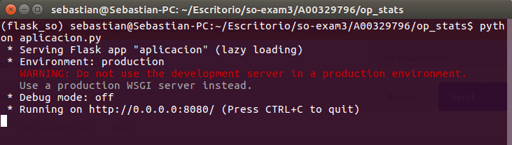
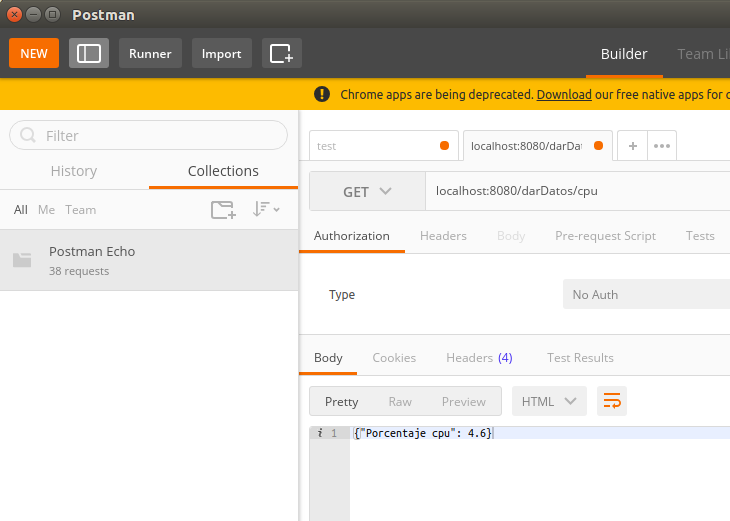
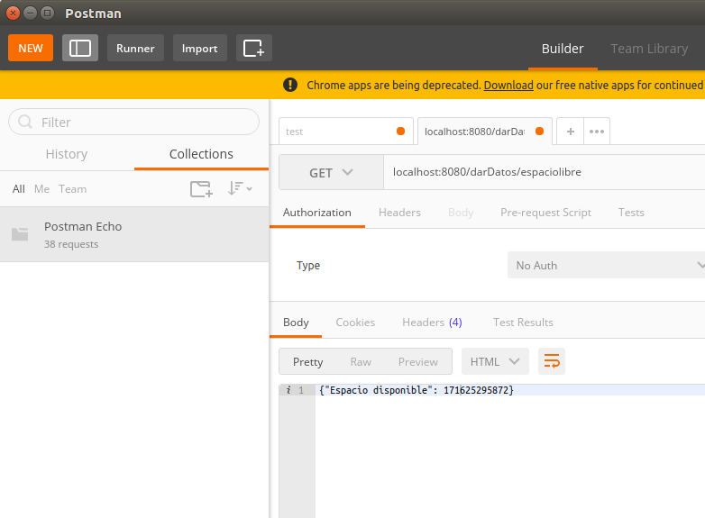
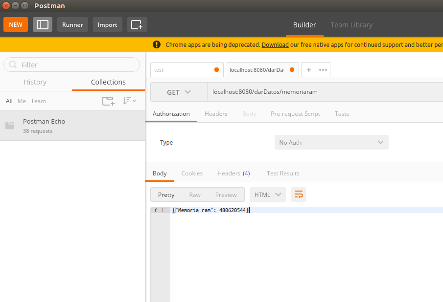
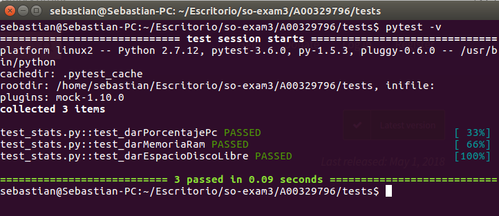
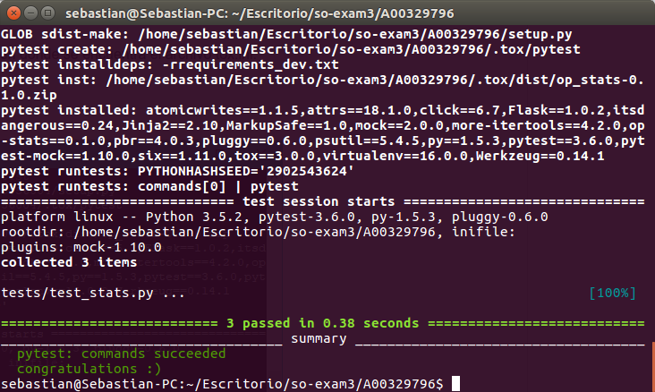

## SO-EXAM 3

**Nombre:** Joan Sebastián García Delgado

**Código:** A00329796

**Url repositorio:** https://github.com/ikermatias/so-exam3/

## Descripción

Realizar tercer parcial del curso Sistemas Operativos Universidad Icesi

## Solución

**1 Punto** Nombre y código agregados 

**2 Punto** Ortografía y redacción

**3 Punto** 
Crear un servicio web Flask

Se creó un servicio web en Flask siguiendo la estructura de clase y se le ha agregado al código app.py métodos extras para cumplir en totalidad el requerimiento.

código
~~~
from flask import Flask
import json
import sys

sys.path.append('/home/sebastian/Escritorio/so-exam3/A00329796/')

from op_stats.datosPc import Datos

app = Flask(__name__)

@app.route('/darDatos/cpu')
def darPorcentajePc():
	porcentaje = Datos.darPorcentajeCpu()
	return json.dumps({'Porcentaje cpu': porcentaje})

@app.route('/darDatos/memoriaram')
def darMemoria():
        memoria = Datos.darMemoriaRam()
        return json.dumps({'Memoria ram': memoria})

@app.route('/darDatos/espaciolibre')
def darEspacioDisco():
        espacio = Datos.darEspacioLibreDisco()
        return json.dumps({'Espacio disponible': espacio})

if __name__ == '__main__':
	app.run(host='0.0.0.0',port=8080)
~~~

Después se ejecuta el comando python aplicación.py que corre la app y permite ver los endpoints con Postman

Ejecución del comando

Postman endpoint Porcentaje CPU

Postman endpoint espacio libre en disco

Postman endpoint memoria ram

**4 Punto** 
Para la implementación de las pruebas unitarias, se le ha agregado las respectivas pruebas al archivo /tests/test_stats.py que validen los métodos anteriormente agregados.

código de test_stats.py
~~~
import pytest
from op_stats.aplicacion import app
from op_stats.datosPc import Datos

import sys
sys.path.append('/home/sebastian/Escritorio/so-exam3/A00329796/')

@pytest.fixture
def client():
    client = app.test_client()
    return client

def test_darPorcentajePc(mocker, client):
    mocker.patch.object(Datos, 'darPorcentajeCpu', return_value=100)
    response = client.get('/darDatos/cpu')
    assert response.data.decode('utf-8') == '{"Porcentaje cpu": 100}'
    assert response.status_code == 200

def test_darMemoriaRam(mocker, client):
    mocker.patch.object(Datos, 'darMemoriaRam', return_value=3000)
    response = client.get('/darDatos/memoriaram')
    assert response.data.decode('utf-8') == '{"Memoria ram": 3000}'
    assert response.status_code == 200

def test_darEspacioDiscoLibre(mocker, client):
    mocker.patch.object(Datos, 'darEspacioLibreDisco', return_value=3000)
    response = client.get('/darDatos/espaciolibre')
    assert response.data.decode('utf-8') == '{"Espacio disponible": 3000}'
    assert response.status_code == 200
~~~

Una vez agregado las pruebas, se procede a ejecutarlas con el comando 'pytest -v'

resultado:

**5 Punto** 
Integración continua con TravisCi

Para el correcto funcionamiento de nuestro repositorio con TravisCI se necesita configurar y ejecutar el archivo 'tox.ini' el cual contiene la información sobre las dependencias a instalar (rrqequirements_dev.txt), comandos a ejecutar (pytest), versión de python y la aplicación que ejecuta los test (pytest)

Ejecución de tox.ini

otro de los archivos que utiliza TravisCI es '.travis.yml' el cual contiene:
sudo --> para determinar si se ejecuta como root
language --> lenguaje de las pruebas
notifications ---> si deseamos recibir al correo cada build que se haga 
versión de python
paquetes a instalar 
ejecución del comando tox.

